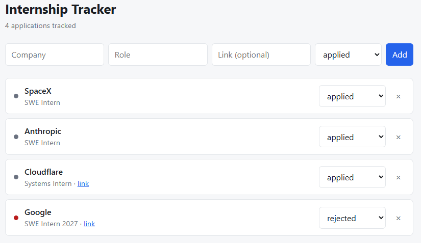

# Internship Tracker

A small full stack app for tracking internship applications: company, role, link, status and notes, with the status editable inline.

Built to learn the full path from database to browser, so the same API is consumed
by two frontends: a plain HTML/CSS/JavaScript version and a React rewrite.




## Features

- Add, list, update and delete applications
- Status tracking (applied, interviewing, offer, rejected) with colour coding
- Input validation on the server, with meaningful HTTP status codes
- 11 API tests running in CI on every pull request

## Stack

| Layer | Choice | Why |
|---|---|---|
| Database | SQLite | No server to run, and the whole database is one file |
| API | Python + Flask | Small enough to read end to end |
| Frontend v1 | HTML, CSS, JavaScript | To learn what the DOM and `fetch` actually do |
| Frontend v2 | React + Vite | Same UI, rebuilt to see what a framework provides |
| CI | GitHub Actions | Tests and build run on every pull request |

## Layout

```
backend/          Flask API and SQLite database
  app.py          Routes
  db.py           Connection and schema
  tests/          pytest suite
frontend/         Plain HTML/CSS/JS version
frontend-react/   React version (Vite)
.github/workflows Continuous integration
```

## Running locally

Requires Python 3.12+ and Node 20+.

**Backend** (port 5000):

```bash
cd backend
python3 -m venv venv
source venv/bin/activate
pip install -r requirements.txt
python app.py
```

**React frontend** (port 5173):

```bash
cd frontend-react
npm install
npm run dev
```

**Plain frontend** (port 5500), as an alternative:

```bash
cd frontend
python3 -m http.server 5500
```

## Tests

```bash
cd backend
source venv/bin/activate
pip install -r requirements-dev.txt
pytest -v
```

Each test runs against a throwaway database, so the suite never touches real data.

## API

| Method | Path | Purpose | Success |
|---|---|---|---|
| GET | `/api/health` | Health check | 200 |
| GET | `/api/applications` | List all, newest first | 200 |
| POST | `/api/applications` | Create one | 201 |
| PATCH | `/api/applications/<id>` | Update given fields | 200 |
| DELETE | `/api/applications/<id>` | Delete one | 204 |

Invalid input returns 400, and an unknown id returns 404.

## Notes

SQL queries use parameterised placeholders rather than string formatting, so user
input can never be executed as SQL. The plain JavaScript frontend escapes values
before inserting them into the DOM; React handles that escaping itself.

## What I learned